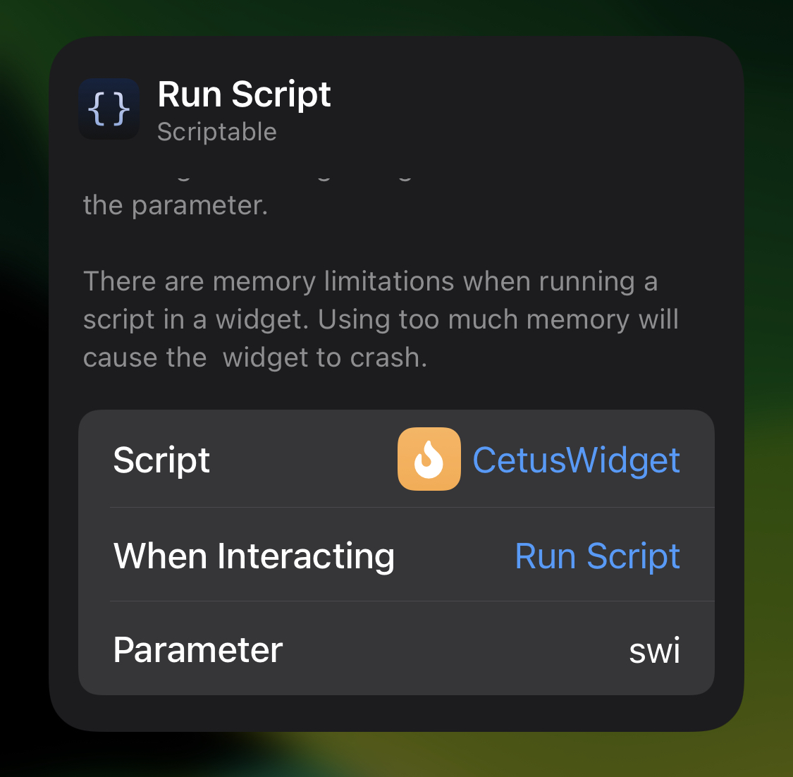

# CetusWidget
## OverView

## Requirement
- iOS >= <u>14.x</u>
- [Scriptable](https://scriptable.app/)
  - CetusWidget.js

## Dependency
- [WarframeStatus API](https://docs.warframestat.us/#tag/Worldstate/paths/~1%7Bplatform%7D/get)
- [unpkg.js](https://gist.github.com/ZicklePop/603b19dd3b9e09f99030bc24e616ca6c)
- [Moment.js](https://momentjs.com/)

## How To Use
1. Save [src/CetusWidget.js](src/CetusWidget.js) to Scriptable.
2. Set the **Medium Size** widget. 
3. Edit the parameter to set your platform.

|parameter|platform|
|---------|--------|
|`(empty)` or `pc`|PC|
|`ps4`|PS4|
|`xb1`|XBoxOne|
|`swi`|Nintendo Switch|

## License
MIT license
